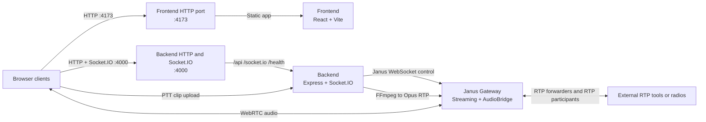

# RTP Voice Application

This repository contains a Docker-first voice application that combines a React frontend, a Node.js signaling service, and Janus Gateway. It supports browser-native voice rooms and RTP interoperability for external tools and devices.

## What It Supports

- Walkie-talkie push-to-talk: browser capture -> backend -> FFmpeg -> Janus Streaming -> WebRTC listeners
- Phone-call rooms: browser clients join Janus AudioBridge rooms for mixed full-duplex audio
- External RTP interop: AudioBridge RTP forwarders and plain RTP participants let VLC, RTP generators, or RTP-capable radios send and receive room audio

## Repository Layout

- `backend/`: Express and Socket.IO service that owns room lifecycle, Janus control, and push-to-talk publishing
- `frontend/`: React and Vite client for walkie-talkie and phone-call room UX
- `infra/janus/`: Janus core plus Streaming, AudioBridge, HTTP, and WebSocket configuration
- `docs/`: deeper architecture, setup, testing, and RTP interoperability notes

## Project Topology



Plain-text fallback:

```text
Browser clients
	|
	| HTTP :4173
	v
Frontend HTTP port (:4173)
	|-----------------------------> Frontend (React + Vite)
	|                               static app

Browser clients
	|
	| HTTP and Socket.IO :4000
	v
Backend HTTP port (:4000)
	|-----------------------------> Janus Gateway (Streaming + AudioBridge)
	|                               WebSocket control + Opus RTP ingest
	|
	+<---------------------------- Browser clients
	|                              PTT clip upload
	|
	+-----------------------------> Browser clients
	|                              room state + signaling

Browser clients <---------------> Janus Gateway
			 WebRTC audio

External RTP tools or radios <-> Janus Gateway
			 RTP forwarders + RTP participants
```

- The frontend is served directly on port `4173`, and the backend API plus Socket.IO are exposed directly on port `4000`.
- The backend owns room state and Janus control, and it converts push-to-talk uploads into Opus RTP for Janus Streaming.
- Janus is the media plane: browsers use WebRTC with Janus directly, while external tools use plain RTP through AudioBridge forwarders or participants.

## Media Paths

### Walkie-talkie mode

1. The browser captures a push-to-talk clip.
2. The clip is sent to the backend over Socket.IO.
3. The backend invokes FFmpeg and sends Opus RTP to a Janus Streaming mountpoint.
4. Janus exposes that stream to listeners over WebRTC.

The walkie-talkie path is tuned for speech: mono Opus, constrained VBR, and in-band FEC for steadier voice quality on weak links.

### Phone-call mode

1. Browsers negotiate WebRTC audio against Janus AudioBridge.
2. Janus mixes the room audio.
3. The backend can create RTP forwarders for downstream consumers.
4. External RTP participants can join the same room alongside browser users.

## Start The Stack

### Prerequisites

- Docker Desktop with Compose support
- Node.js 20+ if you want to run workspace scripts such as `npm test`
- A browser with microphone access
- Optional: VLC for RTP interoperability checks

For local backend runs outside Docker, the app falls back to a bundled `ffmpeg` binary. Set `FFMPEG_PATH` only if you want to override that with a specific executable.

### 1. Set LAN access if needed

Review the defaults in `.env.example`. For same-Wi-Fi access, create a root `.env` file and set your host LAN IP:

```bash
LAN_HOST_IP=192.168.0.17
```

### 2. Build and start everything

```bash
docker compose up --build
```

This starts Janus, the backend, and the frontend together. The frontend and backend run from built images in this stack, so source changes require a rebuild before browser retesting.

### 3. Open the app

- `http://localhost:4173` on the host machine
- `http://LAN_HOST_IP:4173` on other devices on the same Wi-Fi

Plain HTTP is suitable for localhost development. On non-`localhost` LAN origins, some browsers block microphone access because the page is not a secure context. If that happens, use a browser insecure-origin override for testing or restore a trusted HTTPS setup later.

### 4. Verify the services

On Windows PowerShell, use `curl.exe` for the commands below because `curl` maps to `Invoke-WebRequest`.

```powershell
curl.exe http://localhost:4000/health
curl.exe http://localhost:4000/api/rooms
curl.exe http://localhost:4173
curl.exe http://localhost:8088/janus/info
```

The health endpoint should report `ok: true` and `janus.connected: true`.

## Published Ports And Defaults

- Frontend UI: `http://localhost:4173` locally and `http://LAN_HOST_IP:4173` on the same Wi-Fi
- Backend API and Socket.IO: `http://localhost:4000` locally and `http://LAN_HOST_IP:4000` on the same Wi-Fi
- Janus HTTP API: `http://localhost:8088/janus`
- Janus Admin HTTP API: `http://localhost:7088/admin`
- Janus WebSocket API: `ws://localhost:8188`
- Janus Admin WebSocket API: `ws://localhost:7188`
- Static Streaming verification mountpoint: ID `9001` on `6004/udp`
- Static AudioBridge verification room: `7001`
- Dynamic walkie-talkie RTP ingest: `5004-5098/udp` inside Docker
- Janus WebRTC media: `10000-10200/udp`

The dynamic walkie-talkie RTP ingest range stays inside the Docker network. The backend publishes PTT audio to Janus over the container network, so you do not need to bind that range on the Windows host.

## Testing

### Automated checks

```bash
npm test
npm run build
```

### Container and API checks

```powershell
curl.exe http://localhost:8088/janus/info
curl.exe http://localhost:4000/health
curl.exe http://localhost:4000/api/rooms
curl.exe http://localhost:4173
```

### Manual browser checks

Walkie-talkie:

1. Open the app in two tabs or devices.
2. Create a room and join it in walkie-talkie mode from both clients.
3. Hold push-to-talk on one client and speak.
4. Confirm the other client hears the playback.
5. Confirm only one active PTT speaker is shown at a time.

Phone-call:

1. Join the same room in phone-call mode from two clients.
2. Start a call from one client and accept from the other.
3. Confirm two-way audio.
4. End the call and verify the UI returns to idle.

### RTP interoperability checks

Forwarder receive test:

1. Create a room, for example `demo`.
2. Create an RTP forwarder with `pcmu` and payload type `0`.
3. Start VLC on the destination UDP port.
4. Join the room in phone-call mode from a browser.
5. Confirm VLC receives the mixed room audio.

Participant send test:

1. Create a plain RTP participant.
2. Note the returned `janusRtp.port`.
3. Send PCMU or PCMA RTP into that port from VLC or another generator.
4. Join the same room from a browser.
5. Confirm the browser hears the external RTP source.

## Using VLC Or Another RTP Generator

For browser-native flows, keep Opus with payload type `111`. For external RTP tools, prefer AudioBridge interop with `pcmu` and payload type `0`, or `pcma` and payload type `8`.

### 1. Create a room

```powershell
curl.exe -X POST http://localhost:4000/api/rooms `
	-H "Content-Type: application/json" `
	-d "{\"roomId\":\"demo\",\"name\":\"Demo Room\"}"
```

### 2. Receive mixed room audio in VLC

Ask Janus to forward the mixed AudioBridge audio to UDP port `7000` on the host:

```powershell
curl.exe -X POST http://localhost:4000/api/rooms/demo/forwarders `
	-H "Content-Type: application/json" `
	-d "{\"host\":\"host.docker.internal\",\"port\":7000,\"codec\":\"pcmu\",\"payloadType\":0}"
```

Then listen in VLC:

```bash
vlc rtp://@:7000
```

Use a real LAN IP instead of `host.docker.internal` if the RTP receiver is on another machine or device.

### 3. Send audio from VLC into a room

Create an external RTP participant. The response returns the Janus RTP listener that your generator must send to:

```powershell
curl.exe -X POST http://localhost:4000/api/rooms/demo/rtp-participants `
	-H "Content-Type: application/json" `
	-d "{\"displayName\":\"vlc-tx\",\"codec\":\"pcmu\",\"payloadType\":0}"
```

If you also want Janus to send mixed room audio back to the external endpoint, include `remoteHost` and `remotePort` in the request.

Windows microphone example:

```bash
vlc dshow:// :dshow-adev="YOUR MICROPHONE NAME" --sout "#transcode{acodec=ulaw,ab=64,channels=1,samplerate=8000}:rtp{mux=ts,dst=HOST,port=JANUS_PORT,sdp=rtsp://0.0.0.0:8554/vlc.sdp}" --no-sout-all --sout-keep
```

Linux PulseAudio example:

```bash
vlc pulse://default --sout "#transcode{acodec=ulaw,ab=64,channels=1,samplerate=8000}:rtp{mux=ts,dst=HOST,port=JANUS_PORT,sdp=rtsp://0.0.0.0:8554/vlc.sdp}" --no-sout-all --sout-keep
```

Replace:

- `YOUR MICROPHONE NAME` with the actual audio device name
- `HOST` with the host or LAN IP that external RTP senders can reach
- `JANUS_PORT` with the `janusRtp.port` returned by the API

If the API reports a Docker container IP for `janusRtp.host`, use the Docker host or LAN IP together with the returned UDP port when sending from VLC on the host or from another device.

## Using A Real RTP Radio Or RTP Gateway

Use phone-call rooms and AudioBridge for hardware or gateway interoperability. The walkie-talkie Streaming path is tuned for browser uploads via FFmpeg and is not the recommended entry point for external RTP equipment.

A practical setup looks like this:

1. Create or reuse a phone-call room.
2. Create a plain RTP participant so the radio or radio gateway can send audio into the room.
3. Configure the radio or gateway to transmit plain RTP to the host or LAN IP and the returned `janusRtp.port`.
4. Use `pcmu` with payload type `0` or `pcma` with payload type `8` unless the device requires something else.
5. If the radio also needs receive audio from the room, either include `remoteHost` and `remotePort` when creating the RTP participant, or create an AudioBridge RTP forwarder that sends the mixed room audio to the radio or gateway.

Important constraints:

- The hardware must speak plain RTP. If it uses SIP, analog audio, or a vendor-specific transport, put an RTP-capable gateway in between.
- In Docker, Janus may report a container IP. External devices should target the host machine's reachable IP with the returned UDP port.
- Keep Janus NAT, STUN, and exposed UDP ranges aligned before moving beyond localhost or a single LAN.

## Operational Notes

- `JANUS_STREAMING_ADMIN_KEY` must match `infra/janus/janus.plugin.streaming.jcfg`.
- `JANUS_AUDIOBRIDGE_ADMIN_KEY` must match `infra/janus/janus.plugin.audiobridge.jcfg`.
- The stack intentionally leaves Janus STUN unset for local Docker use. Add reachable STUN or TURN settings before deploying across NAT boundaries.
- The static Streaming verification mountpoint uses UDP `6004` to avoid the dynamic `5004-5098` ingest range.
- The Janus admin APIs are published locally for inspection. Tighten that before exposing the stack outside local development.

## Documentation

- [docs/architecture.md](docs/architecture.md)
- [docs/setup-and-operations.md](docs/setup-and-operations.md)
- [docs/testing-checklist.md](docs/testing-checklist.md)
- [docs/vlc-interop.md](docs/vlc-interop.md)